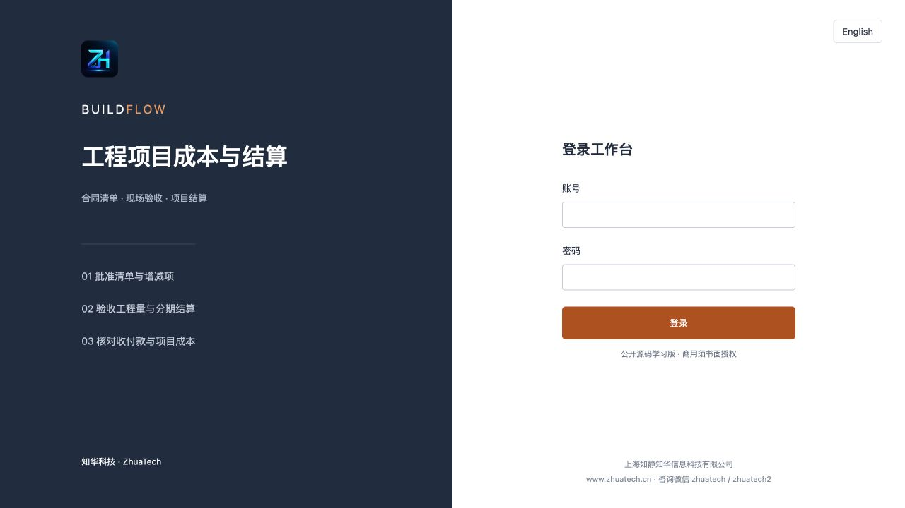
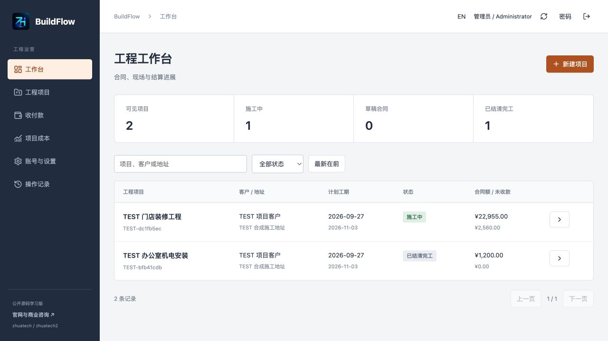
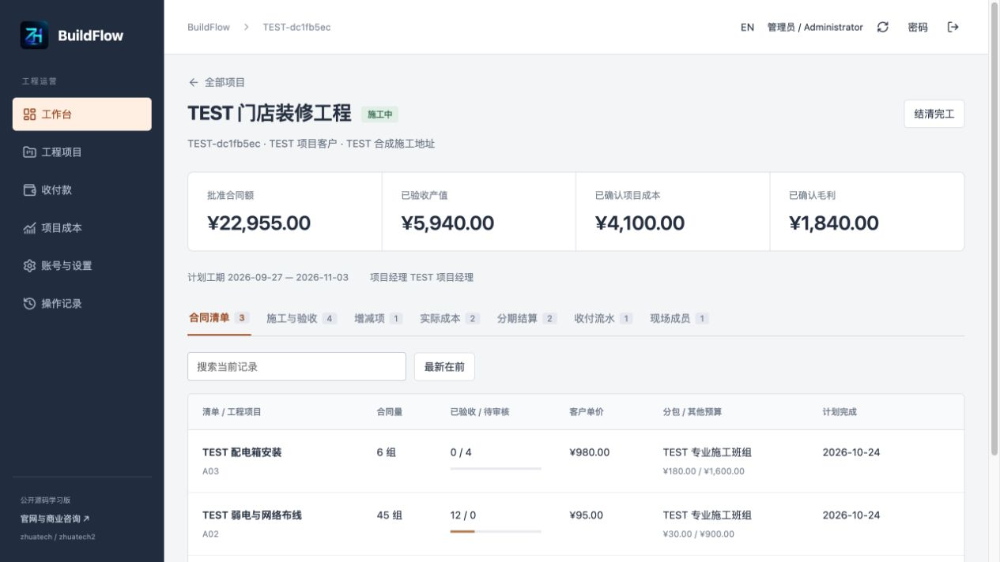
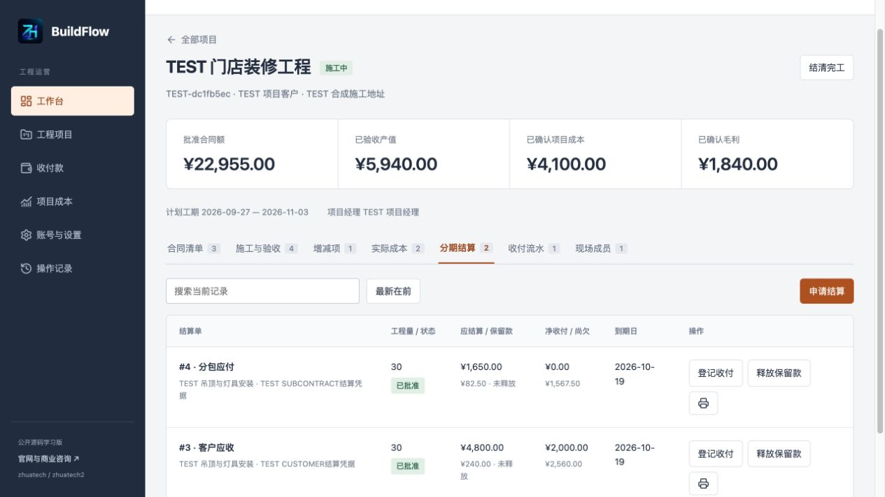
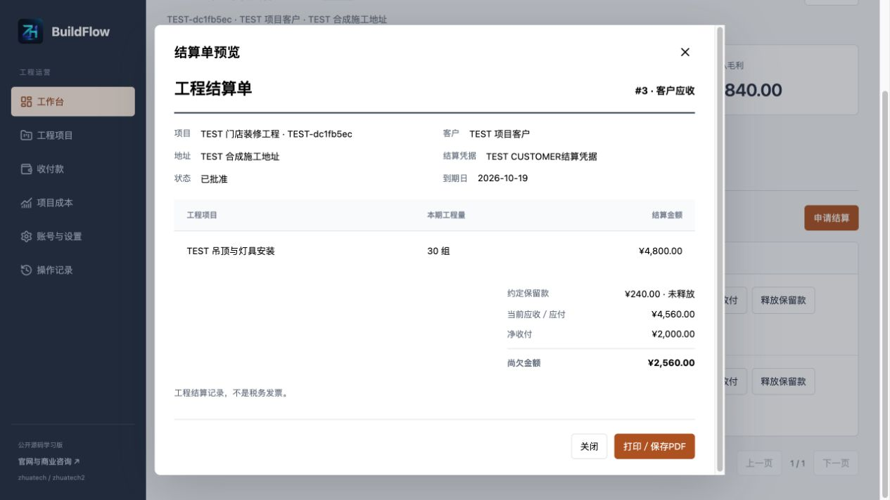
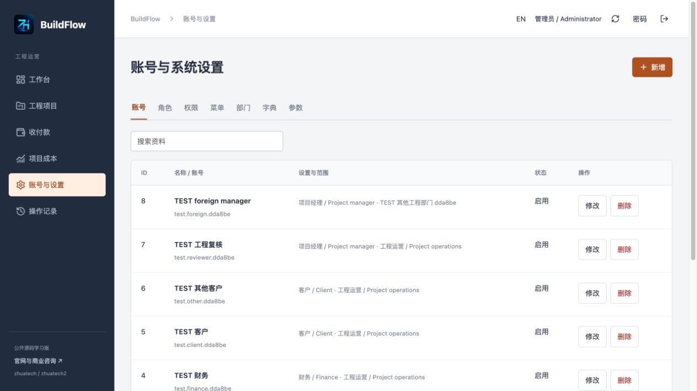
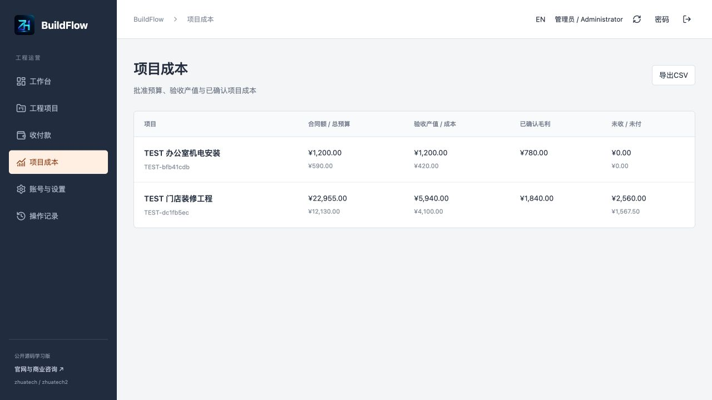
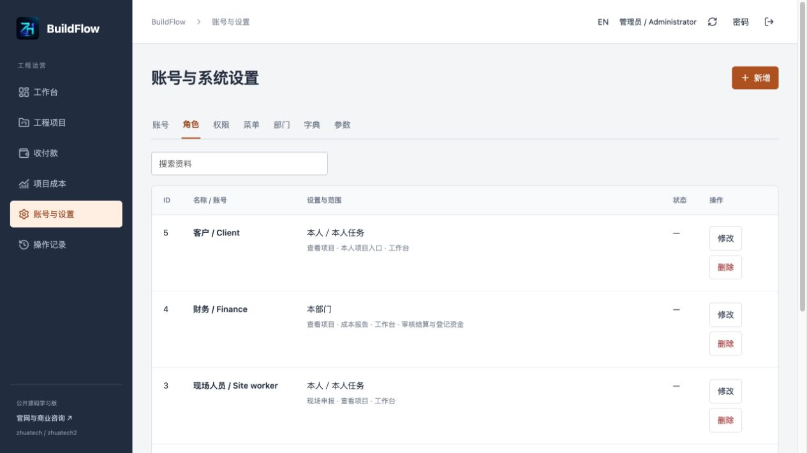
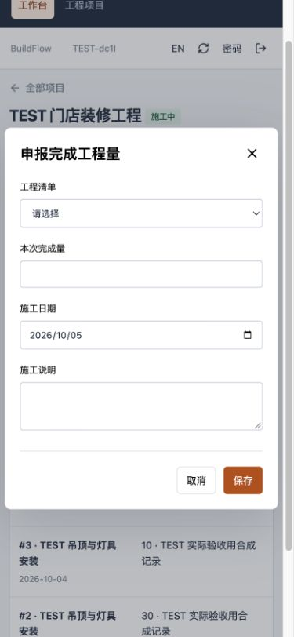

<p></p>

# BuildFlow · 知华工程项目成本与结算

**从合同清单、现场验收到分期结算，核对每个项目的工程量和钱。**

知华科技（上海如静知华信息科技有限公司） · [官网](https://www.zhuatech.cn/) · 1.0.0公开源码学习版／非商业源码版。未经书面授权不得商用，自有代码以[LICENSE](LICENSE)为准；不属于OSI标准开源许可。

## 哪些团队可以评估

适合装修、机电安装、小型施工承包团队，以及需要部署和适配工程软件的实施团队。一个企业实例、多部门、多项目；中英文、手机现场入口和客户本人查看入口。核心业务不需第三方账号。

项目经理建立合同清单与分包单价；现场人员按完成量申报并上传照片；其他人员独立验收；财务审核按验收量计算的客户/分包结算，再登记已经完成的线下收付款。系统把未批准增项、未验收工程量、已结算量及尚欠款区分开，便于核对。

```text
草稿合同＋工程清单 → 激活冻结单价 → 现场申报＋照片 → 独立验收
                      ↑                               ↓
              增减项申请＋独立批准              客户应收／分包应付
                                                      ↓
直接成本凭据 → 财务审核                 分期收付＋保留款释放
                                                      ↓
                                 全量验收、账款清零 → 结清完工
```

### 当前真实实现

| 模块 | 可操作能力 |
| --- | --- |
| 合同清单 | 草稿项目增改删、部门/经理/客户绑定、施工日期、草稿清单增改删、激活冻结、数量和成本预算增减项 |
| 项目团队 | 明确添加/移除现场成员，移除后立即禁止访问 |
| 施工与验收 | 工程量与日期、说明、实际PNG/JPEG照片、另一人员批准或退回；待审与批准量不能超合同 |
| 结算 | 客户和分包分别按验收工程量分期计量，冻结单价计算、独立审核、保留款冻结与有凭据释放 |
| 资金记录 | 人工登记已完成交易、分次支付、关联退款/冲正、幂等重试、禁止覆盖历史 |
| 成本 | 直接成本独立审批，分包结算自动计成本；计划与已确认毛利、应收应付和CSV对账 |
| 岗位页面 | 项目经理、现场、财务与绑定客户；客户和现场API响应也过滤内部成本/分包等字段 |
| 系统管理 | 账号/角色/权限显示名/菜单/部门/成本字典/参数，搜索分页，最后管理员保护、密码散列和审计 |
| 部署与安全 | MySQL持久化、Flyway、同源会话与CSRF、项目锁/版本校验、非root容器与健康检查 |

### 使用边界

当前是单企业、单币种、小规模工程实例；清单单价激活后冻结，增减项调整现有清单数量与其他预算。新工程种类或重定价使用独立新项目；已有批准记录不覆写。合同定金、材料采购/库存、甘特依赖排程、ERP/BIM/CAD连接、电子签名、税务发票、在线支付、多币种换算、离线同步与大型容量保障不包含。软件界面支持中英文，业务文本不自动翻译。

资金登记**不会移动真实资金**，结算单不是税务发票。保留款比例是人工合同约定，不预设法定规则；毛利基于已审核直接成本与分包结算，不含企业间接费、税费及未入账事项，不是法定财务报表。无真实客户采用、营业收入或认证声明。

## 实际运行页面

截图使用合成TEST资料，不是真实客户或效果图。

| 登录 | 岗位工作台 |
| --- | --- |
|  |  |

**合同工程量与验收**



**结算、保留款及资金**



**单张结算单预览**



| 管理账号 | 项目成本 |
| --- | --- |
|  |  |

**角色与数据范围**





## 启动与首次使用

要求Docker/Compose v2、Python3；源码开发Java21/Maven3.9、Node24.19.0/npm。后端Spring Boot4.0.7、Security、JPA、Flyway，数据库MySQL8.4，通过MariaDB JDBC3.5.10连接；前端Vue3.5.40/Vite8.1.5、Nginx。版本以pom和锁文件为准。

```bash
python3 scripts/init-env.py
docker compose config --quiet
docker compose up --build -d --wait --wait-timeout 240
```

访问[http://127.0.0.1:8104/](http://127.0.0.1:8104/)，健康`/actuator/health`。端口被占用修改私有.env的WEB_PORT，不能停止其他项目。默认仅绑定本机。

初始化账号`admin`，密码在本人私有.env的ADMIN_PASSWORD；init-env.py生成随机强密码、0600并拒绝覆盖。首次空库只有岗位、权限、菜单、字典和参数，没有客户或合同。随后创建项目经理、现场、财务和可选客户账号，再建合同清单和明确成员。具体[操作手册](docs/manual.md)。

| 环境变量 | 用途 |
| --- | --- |
| MYSQL_ROOT_PASSWORD / DATABASE_PASSWORD | 独立数据库强密码，示例为空字段 |
| ADMIN_USERNAME / ADMIN_PASSWORD | 首次初始化管理员，后续重启不重置 |
| WEB_PORT / BIND_ADDRESS | 端口与访问范围，默认8104/127.0.0.1 |
| COOKIE_SECURE | HTTPS入口设true，本机HTTP检查为false |
| DATABASE_URL / DATABASE_USER | 可选外部MySQL地址及账号，只放私有配置 |

开发：准备独立MySQL，注入环境变量，在backend运行`mvn spring-boot:run`，在frontend运行`npm ci && npm run dev`。Vite代理本机8080，生产Nginx代理服务名backend，不把localhost服务地址写入生产客户端。

```text
backend/  cn.zhuatech.buildflow：认证、项目、验收、成本与结算
frontend/ Vue岗位界面、手机现场与管理端
scripts/  私有环境初始化、实际HTTP与发布核查
docs/     操作、API、数据库、安全、测试和部署
```

数据库`zhuatech_buildflow`，18张应用表及Flyway历史；[V1建表迁移](backend/src/main/resources/db/migration/V1__build_schema.sql)包含外键、唯一约束、索引与数量金额约束。结构见[数据库](docs/database.md)，流程及数据范围见[架构](docs/architecture.md)。升级先停写备份，只新增递增迁移；禁止修改已执行迁移或用repair掩盖差异。备份恢复和容器指令见[部署](docs/deployment.md)。

## 验证与故障

```bash
# backend
mvn spotless:check test package
# frontend
npm ci
npm run format:check
npm run lint
npm test
npm run build
# project root
docker compose config --quiet
python3 scripts/release-check.py
git diff --check
```

实际HTTP验收仅在专用可丢弃本机环境：配置BASE_URL和ADMIN_PASSWORD后，`ALLOW_TEST_DATA=1 python3 scripts/smoke.py`。不能在业务库运行。测试覆盖范围和实际验收说明见[测试](docs/testing.md)。Docker镜像构建不跳过后端测试。

启动失败读Compose健康和日志，检查必填环境与数据库版本；数量超限先检查待审/验收/结算；独立审核失败改用另一岗位账号；版本冲突先刷新；结清失败检查未验收、未结算、待审核、保留款和余额。不要靠删原流水平账，也不要删除其他容器/卷。[API](docs/api.md)提供错误和权限说明。

生产需HTTPS、受控访问、唯一密码、数据库备份恢复和更新维护；.env、会话、客户资料、真实现场照片和备份不得提交Git。[安全说明](docs/security.md)。

## 联系知华科技与授权

个人学习、技术研究和非商业交流按LICENSE；商业使用、私有化部署、收费交付、二次销售、SaaS与商业二次开发须书面授权。第三方许可分别保留，见[第三方说明](docs/third-party.md)。贡献和Issues提供脱敏可复现资料，安全漏洞通过官网/微信私下反馈，见[贡献](docs/contributing.md)。软件按现状提供，正式业务服务范围以书面协议为准。

本项目由知华科技（上海如静知华信息科技有限公司）提供公开源码学习版本，主要用于个人学习、技术研究与非商业交流。未经书面授权不得商用。企业信息化建设、中小企业数字化转型、中小企业 AI 转型、私有化部署、软件外包、软件项目外包、软件实施、FDE 外包、OPC 技术支持及深度定制开发，请访问知华科技官网 https://www.zhuatech.cn/，或添加微信 zhuatech、zhuatech2 咨询。

- 官网：https://www.zhuatech.cn/
- 商业授权、定制开发、部署与系统集成咨询微信：`zhuatech`、`zhuatech2`

<table><tr><td align="center"><br>微信：zhuatech</td><td align="center"><br>微信：zhuatech2</td></tr></table>
